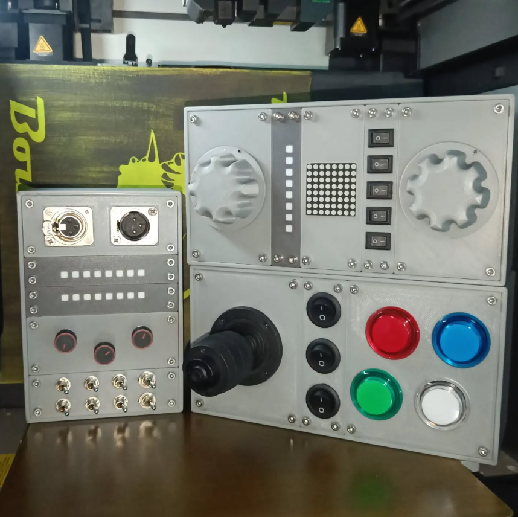

# ModularControlPanel
Modular Test Case for Electronics &amp; Prototyping

# 🛠️ Modular Test Case for Electronics & Prototyping

This modular test module is designed as a universal interface for developing, debugging, and showcasing electronics projects. Whether you're working with microcontrollers like the ESP32 or testing your own PCBs, this box is your new best friend on the bench.

---

---

## 🔌 Features

- Large rotary knobs for simulating analog input (e.g., potentiometers or encoders)
- LED bar & dot matrix display for visual output feedback
- Joystick & arcade-style buttons for interactive testing or UI prototyping
- Toggle switches to simulate system states or input conditions
- BNC & XLR connectors for quick interfacing with test gear
- Colored panel-mount buttons for clear visual signaling
- 3D-printed housing with an industrial look and sturdy mounting
- Interchangeable panels for experimenting with case layout

---

## 🧩 Modularity & Customization

The design is fully modular — components can be swapped, extended or adapted.  
You can 3D print custom brackets and component fittings for your own electronics, like Arduino or ESP32, and glue them directly into the case for a clean, secure fit.

The case design is fully parametric, allowing you to easily adapt the size of the enclosure:

- **userWidth**: total width of the case (defines how many slots your panel can take)
- **userDepth**: total depth of the case

👉 **Fusion 360 design file:** [https://a360.co/3HmZ7jt]

> Note: The panel height is fixed at 100 mm — only width and depth are adjustable via parameters.

---

## 🖨️ Print Info

- All parts 3D printed on a **Bambu Lab X1 Carbon**
- Printed in **PLA**
- Use **M3 bolts** to easily lock the panels in place

---

## 🎯 Use Cases

Perfect for:

- STEM education
- Electronics workshops
- Industrial simulation
- Game controller prototyping
- IoT development
- Any hands-on testing setup 💡

---

## 🚀 Future Upgrades

Got ideas for upgrades? Think OLED displays, RFID readers, piezo buzzers, or even haptic feedback. This build is ready to evolve.

---

## 📦 Bill of Materials (BOM)

| Part | Qty | Link |
| ---- | --- | ---- |
| 10K OHM Linear Taper Potentiometer Solder Lugs Round Shaft Dia: 6.35mm | 1 | [Tayda Electronics](https://www.taydaelectronics.com/b10k-ohm-linear-taper-potentiometer-round-shaft-solder-lugs-l.html) |
| MAX7219 Dot Matrix LED Display Module | 1 | N/A |
| NeoPixel Stick - 8 x WS2812 | 1 | N/A |
| 409B-M4 Joystick | 1 | N/A |
| LED Arcade Buttons | 1 | N/A |

*Other generic components like switches, wires, connectors, and mounting hardware are assumed to be standard parts depending on your build.*

---

## 📦 Source Files & Documentation

👉 Full source & files on GitHub: [https://github.com/Boutsman/ModularControlPanel](https://github.com/Boutsman/ModularControlPanel)

---

## 📝 License

This project is licensed under the [MIT License](LICENSE).

---

## 🙌 Contributions

Pull requests, suggestions, and upgrades are always welcome. If you build your own version, feel free to share it!

---

## ☕ Buy Me a Coffee

If you like the project and want to support future builds:

---

Made with ❤️ by Stijn.
